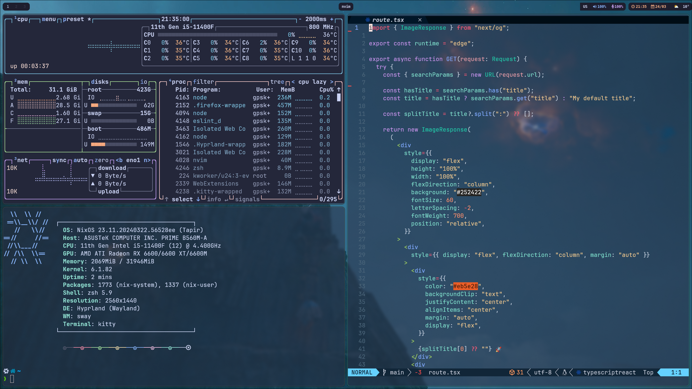

# NixOS + Hyprland (Secureboot enabled)

> WARNING! This configuration uses [lanzaboote](https://github.com/nix-community/lanzaboote) for Secure boot support. If you want to use the flake and don't need secure boot, make appropriate changes in [boot.nix](./system/boot.nix).

> WARNING! Make sure to change [hardware-configuration.nix](./hardware-configuration.nix) according to your PC or generate a new one via `nixos-generate-config --root /mnt` while installing.

> WARNING! Make sure to change home paths for config files in [user](./user/config).

> WARNING! There might be some non-critical bugs in configuration as I'm still working on it.

## Table Of Contents

- [About](#-about)
- [Components](#-components)
- [Keybindings](#-keybindings)
- [NixOS specific zsh aliases](#-nixos-specific-zsh-aliases)
- [License](#-license)

## About

This repository is housing my daily drive NixOS configuration using ❄️ flakes, running Hyprland. Feel free to utilize it in its entirety or borrow specific components for your own configuration.

> Configuration is not lightweight and may require some disk space.

Notably, it utilizes:

- **flake** (Experimental feature of the Nix package manager)
- **nixpkgs**: unstable (only used for hyprshot & [Vesktop](https://github.com/Vencord/Vesktop))

## Components

| Component        | Version/Name                                         |
| ---------------- | ---------------------------------------------------- |
| Distro           | NixOS                                                |
| Shell            | Zsh                                                  |
| Display Server   | Wayland                                              |
| WM (Compositor)  | Hyprland                                             |
| Bar              | Waybar                                               |
| Notification     | Mako                                                 |
| Launcher         | Wofi                                                 |
| Editor           | Neovim                                               |
| Terminal         | Kitty                                                |
| Fetch Utility    | Neofetch                                             |
| Theme            | Catppuccin Macchiato                                 |
| Icons            | Colloid-teal-dark, Numix-Circle                      |
| Font             | Nerd-fonts NixOS package (installing all nerd-fonts) |
| File Browser     | Thunar                                               |
| Internet Browser | Firefox                                              |
| Screenshot       | Hyprshot                                             |
| Clipboard        | wl-clipboard                                         |
| Idle             | Swayidle                                             |
| Lock             | Swaylock                                             |
| Logout menu      | Wlogout                                              |
| Wallpaper        | Hyprpaper                                            |
| Display Manager  | SDDM                                                 |
| Containerization | Docker                                               |
| Virtualisation   | qemu + virt-manager + libvirtd                       |

## Keybindings

| Key Combination           | Action                                                                |
| ------------------------- | --------------------------------------------------------------------- |
| SUPER + H, J, K, L        | Change window focus                                                   |
| SUPER + CTRL + H, J, K, L | Resize window                                                         |
| SUPER + 1..0              | Change workspace                                                      |
| SUPER + SHIFT + 1..0      | Move window to workspace                                              |
| SUPER + Q                 | Kill active window                                                    |
| SUPER + S                 | Toggle split                                                          |
| SUPER + M                 | Exit from `hyprland`                                                  |
| SUPER + Return            | Launch `kitty`                                                        |
| SUPER + D                 | Launch `wofi`                                                         |
| SUPER + E                 | Launch `thunar`                                                       |
| SUPER + M                 | Launch `wlogout`                                                      |
| SUPER + SHIFT + L         | Launch `swaylock`                                                     |
| Print                     | Take screenshot (currently configured to area capture into clipboard) |

All other keybindings can be found at [bind.conf](./user/config/hypr/bind.conf)

## NixOS specific zsh aliases

- **fullClean** - Fully clean old generations data
- **rebuild** - alias to `nixos-rebuild switch`
- **fullRebuild** - same as previous but also includes `home-manager switch`
- **homeRebuild** - only rebuild home-manager

> Make sure to make appropriate changes to [sh.nix](./user/sh.nix) flake paths.

## License

This project is licensed under the MIT License - see the [LICENSE](LICENSE) file for details.
